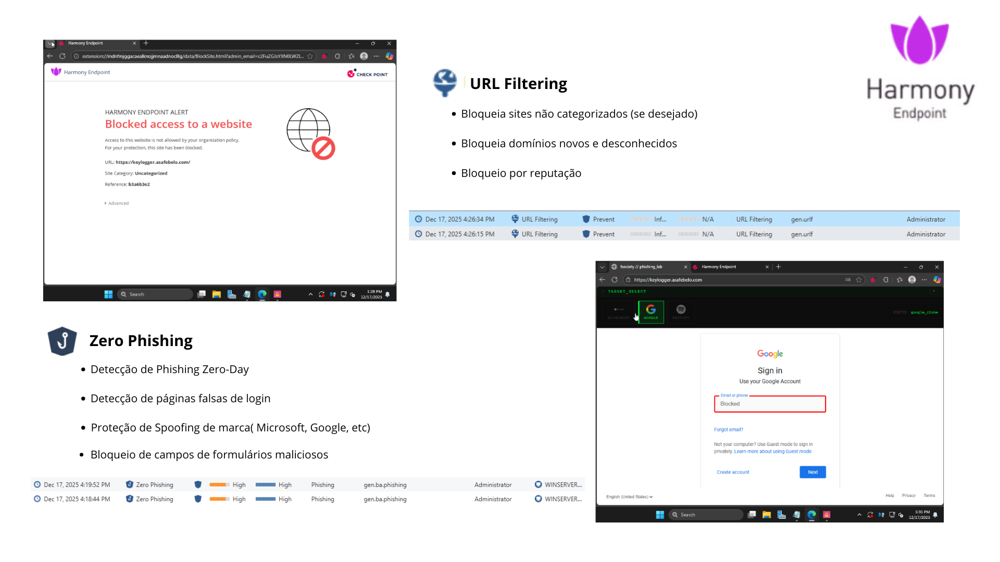

# Keylogger - Apresentação Check Point

Este projeto demonstra conceitos de segurança cibernética através de um keylogger educacional e templates de phishing, desenvolvido para apresentação Check Point.

## ⚠️ Aviso Legal

Este projeto é apenas para fins educacionais e de pesquisa em segurança cibernética. O uso inadequado de ferramentas de keylogging e phishing é ilegal e antiético. Sempre obtenha autorização adequada antes de realizar testes de segurança.

## 📋 Conteúdo

- Demonstração de keylogger
- Templates de phishing educacionais
- Boas práticas de segurança
- Proteção contra ameaças

## 🎯 Templates de Phishing

Este projeto inclui templates educacionais que demonstram como ataques de phishing funcionam:

### Microsoft Template

Template que simula página de login da Microsoft para demonstração de técnicas de phishing.

### Google Template

Template que simula página de login do Google para fins educacionais de segurança.

### Spotify Template

Template que simula página de login do Spotify para demonstração de vetores de ataque.

## 🔒 Segurança e Proteção

### Proteção de Endpoint com Harmony

A segurança contra keyloggers e phishing requer uma abordagem em camadas. O Check Point Harmony oferece proteção avançada de endpoint contra:

- **Keyloggers**: Detecção e bloqueio de software malicioso que captura teclas digitadas
- **Phishing**: Proteção contra sites fraudulentos e tentativas de roubo de credenciais
- **Malware**: Defesa em tempo real contra ameaças conhecidas e desconhecidas
- **Zero-day exploits**: Proteção proativa contra vulnerabilidades não conhecidas

## 🛡️ Melhores Práticas de Segurança

1. **Autenticação Multi-Fator (MFA)**: Sempre que possível, habilite MFA em suas contas
2. **Verificação de URLs**: Sempre verifique a URL antes de inserir credenciais
3. **Educação em Segurança**: Mantenha-se informado sobre as últimas ameaças
4. **Software Atualizado**: Mantenha seu sistema operacional e aplicações atualizados
5. **Solução de Segurança**: Use software antivírus e proteção de endpoint confiável

## 🎓 Propósito Educacional

Este projeto foi desenvolvido para:
- Demonstrar como ataques de phishing são construídos
- Educar sobre riscos de segurança cibernética
- Promover conscientização sobre proteção digital
- Apresentar soluções de segurança empresarial

## 📞 Contato

Para mais informações sobre segurança cibernética e soluções Check Point, entre em contato através dos canais oficiais.

---

**Lembre-se**: O conhecimento sobre ameaças de segurança é essencial para proteção, mas deve ser usado de forma ética e responsável.